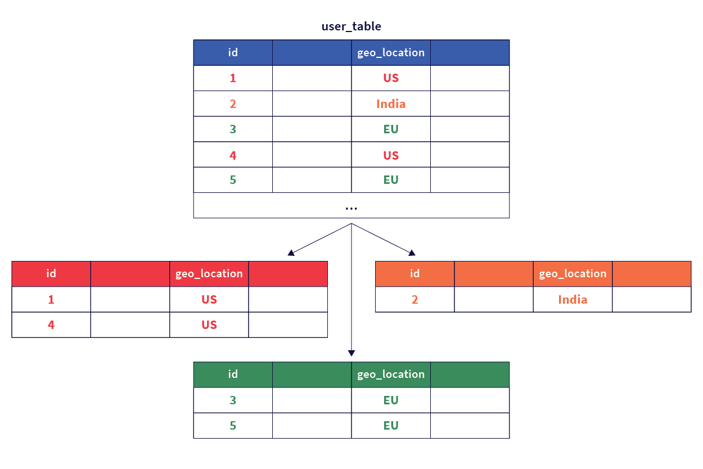

# 6 ExamplesYugabyte *geo*-*partitioning*

*outline draft* todo current state is working on code and steps to demonstrate the 6 use cases.

Demonstrate the following use cases for geo-partitioning. Goal is to find customer questions and actual problems to show.a solution using geo-partitioning. Following 5 use cases to cover the inital questions a customer may have when first starting to use row level geo-partitioning:

1. *code to load transaction data into 3 different regions US, GR and India. show examples of data with partitioning and table spaces*. Example of transactional write to 3 regions. Read from 3 regions. Read before write. 
   1. write data to both the region defined in the parition and different regions. Region is US. Write US records concurrently to US, GR and India.  show rows are stored in the correct regions
2. *code to use a default table space and 3 different regions US, GR and India. show the use of partitioning and table spaces*. What happens to data records not defined in the paritions say records for Austrila or Russia when regions defined are (US, Germany and India)?
3. Code and all the steps to support when adding a new region in the US and splitting the current geo-data in the US into 2 regions. How does data migrate?
4. Code and all the steps to support*Use case for what happens to geo-partitioned data when a when a region goes down.* 
5. Code and all the steps to support *Use case when a heavy load is applied to the database using geo-partitioning partitioning*
6. Code and all the steps to support example of migration to YB using exported data from another system. Example. JSON, CSV or other files. 

-----

# Purpose

This post is an in-depth look at the various use cases that applications and customers needing low latency and high availability can review when evaluating using a geo-distributed SQL database like [YugabyteDB](https://github.com/yugabyte/yugabyte-db). Goal is to make users better shopped with demonstrable code and steps showing a use case applicable to real-world operations. 

## Background

[Yugabyte Platform](https://yugabyteweb.wpengine.com/yugabytedb/) gives you the simplicity and support to deliver a private database-as-a-service (DBaaS) at scale. Use Yugabyte Platform to deploy YugabyteDB across any cloud anywhere in the world with a few clicks, simplify day 2 operations through automation, and get the services needed to realize business outcomes with the database. 

YugabyteDB on AWS is a powerful option and many customer want to run on AWS and have applications or recovery requirements that require multi-region deployments.

**Problem**

Geo-partitioning of data is critical to some global applications. However, global applications are not deployed using one particular multi-region deployment topology. The multi-region deployment topologies could vary significantly depending on the needs of the application, some of which are very common and critical. *reference https://blog.yugabyte.com/geo-partitioning-of-data-in-yugabytedb/*

**Solution**

Yugabyte provides a solution to enable row level geo-paritioning of data to be stored physically in the region defined by the paritioning key. 

Geo-partitioning of data enables fine-grained, row-level control over the placement of table data across different geographical locations. This is accomplished in two simple steps – first, partitioning a table into user-defined table partitions, and subsequently pinning these partitions to the desired geographic locations by configuring metadata for each partition. *reference https://blog.yugabyte.com/geo-partitioning-of-data-in-yugabytedb/*

## Setup 

First step is to buld out the multi-region cluster. Reference post on multi-region AWS clusters and run the Cloudformation scripts

Next, run the setups for each of the examples. 

## Demo for each use case

need steps for each case 1-6 added here... 

Pre-

Create AWS account

Mulit-Region Infrastructure

- Network infrastructures
- Yugabyte platform

Database build

Run the use cases

Use case 1 Basic

Example of transactions saved to 3 regions

Use case 2 Default table space

Example of transactions and usage of default tablespace

Use case 3 New region

