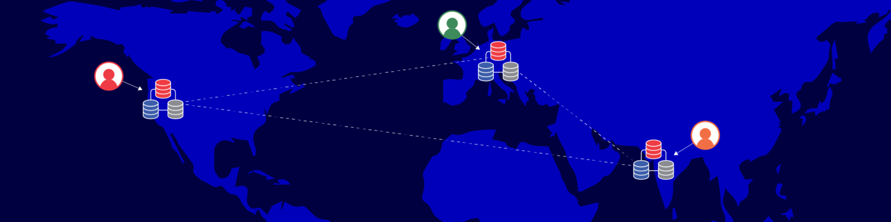

# 5 ExamplesYugabyte Geo-Location

Purpose

Problem

Geo-partitioning of data is critical to some global applications. However, global applications are not deployed using one particular multi-region deployment topology. The multi-region deployment topologies could vary significantly depending on the needs of the application, some of which are very common and critical. reference 

Solution

Demo 

Pre-

Create AWS account

Mulit-Region Infrastructure

- Network infrastructures
- Yugabyte platform

Database build

Run the use cases

Use case 1 Basic

Example of transactions saved to 3 regions

Use case 2 Default table space

Example of transactions and usage of default tablespace

Use case 3 New region

